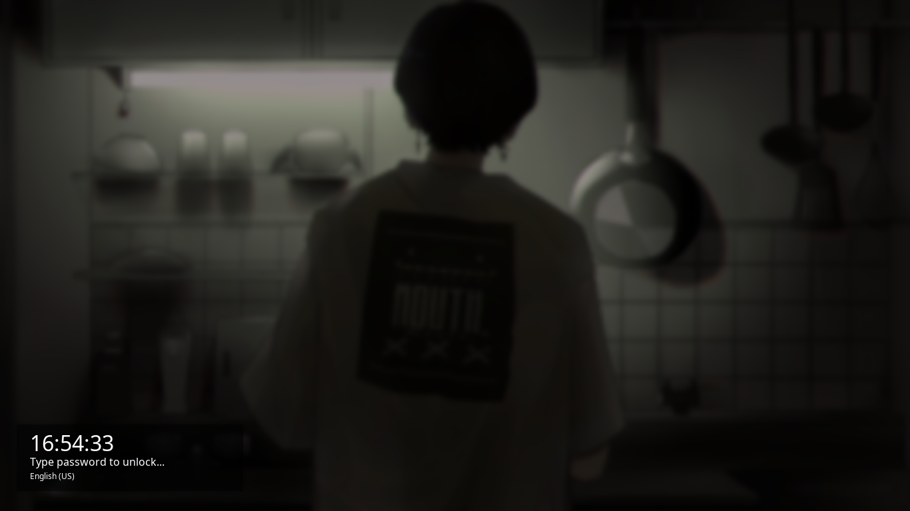

# Betterlockscreen



## Install [_Betterlockscreen_](https://github.com/betterlockscreen/betterlockscreen):

```bash
yay -S betterlockscreen
```

## Enable betterlockscreen

```bash
systemctl enable betterlockscreen@$USER
```

> If you want config :

```bash
cp /usr/share/doc/betterlockscreen/examples/betterlockscreenrc ~/.config
```

## Usage

Run `betterlockscreen` and point it to either a directory (`betterlockscreen -u "path/to/dir"`) or an image (`betterlockscreen -u "/path/to/img.jpg"`) and that's all. `betterlockscreen` will change update its cache with image you provided.

```sh
Usage: betterlockscreen [-u <PATH>] [-l <EFFECT>] [-w <EFFECT>]

  -u --update <PATH>
      Update lock screen image

  -l --lock <EFFECT>
      Lock screen with cached image

  -w --wall <EFFECT>
      Set wallpaper with cached image

Additional arguments:

  --display <N>
      Set display to draw loginbox

  --span
      Scale image to span multiple displays

  --off <N>
      Turn display off after N seconds

  --fx <EFFECT,EFFECT,EFFECT>
      List of effects to apply

  -- <ARGS>
      Pass following arguments to i3lock

Effects arguments:

  --dim <N>
      Dim image N percent (0-100)

  --blur <N>
      Blur image N amount (0.0-1.0)

  --pixel <N,N>
      Pixelate image with N shrink and N grow (unsupported)

  --color <HEX>
      Solid color background with HEX
```

#### Examples

1. Update image cache with random image
   `betterlockscreen -u ~/Wallpapers`

2. Update image cache with only dim and pixel effects
   `betterlockscreen -u ~/Wallpapers/image.png --fx dim,pixel`

3. Update image cache with random image, multiple monitors, login on 1, spanning
   `betterlockscreen -u ~/Wallpapers/Dual/ --display 1 --span`

4. Update image cache with solid background only (ignore errors)
   `betterlockscreen -u . --fx color --color 5833ff`

5. Update image cache with different background images
   `betterlockscreen -u ~/Wallpapers/image1.png -u ~/Wallpapers/image2.png`

6. Lock screen with blur effect
   `betterlockscreen --lock blur`

7. Lock screen with multiple monitors, spanning
   `betterlockscreen -l dimblur --display 1 --span`

## Background

Add this line to `.xinitrc`.

```sh
# set desktop background with custom effect
betterlockscreen -w dim

# Alternative (set last used background)
source ~/.fehbg
```

### i3wm

Add this line to `~/.config/i3/config`

```sh
# set desktop background with custom effect
exec --no-startup-id betterlockscreen -w dim

# Alternative (set last used background)
exec --no-startup-id source ~/.fehbg
```

## Keybindings

To lockscreen using keyboard shortcut

### i3wm

Add this line to your `~/.config/i3/config`

```sh
bindsym $mod+shift+x exec betterlockscreen -l dim
```

### bspwm

Add this line to your `~/.config/sxhkd/sxhkdrc`

```sh
# lockscreen
alt + shift + x
    betterlockscreen -l dim
```

<h2 id="systemd">Systemd-Service: Lockscreen after sleep/suspend</h2>

```sh
# move service file to proper dir (the aur package does this for you)
cp betterlockscreen@.service /usr/lib/systemd/system/

# enable systemd service
systemctl enable betterlockscreen@$USER

# disable systemd service
systemctl disable betterlockscreen@$USER

# Note: Now you can call systemctl suspend to suspend your system
# and betterlockscreen service will be activated
# so when your system wakes your screen will be locked.
```

## More detail

Go [HERE](https://github.com/betterlockscreen/betterlockscreen)
