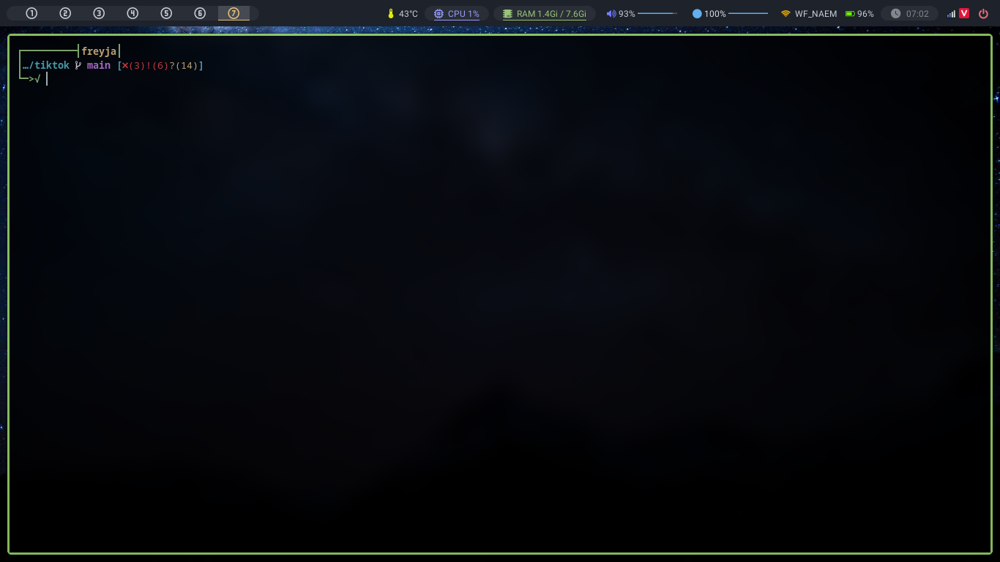

# Fish



## Install [_fish_](https://github.com/fish-shell/fish-shell):

```bash
sudo pacman -S fish
```

## Switching to fish

```bash
chsh -s /usr/local/bin/fish
```

## Copy my config:

```bash
git clone https://github.com/Dominic-github/dotfiles.git --depth 1
cp -a dotfiles/.config/fish ~/.config
rm -rf dotfiles
```

## Switching to another shell

```bash
chsh -s /bin/bash
```

## More detail

Go [here](https://fishshell.com/)
