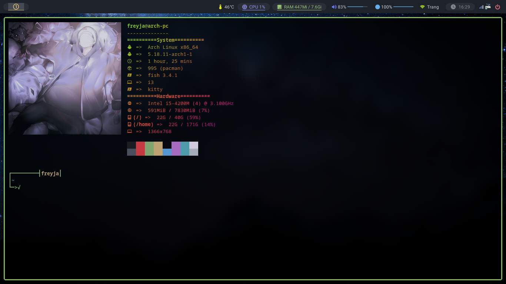

# Neofetch



## Install [_neofetch_](https://github.com/dylanaraps/neofetch) :

```bash
sudo pacman -S neofetch
```

> If you want show image on terminal go [here](https://github.com/Dominic-github/dotfiles/tree/main/.config/kitty)
