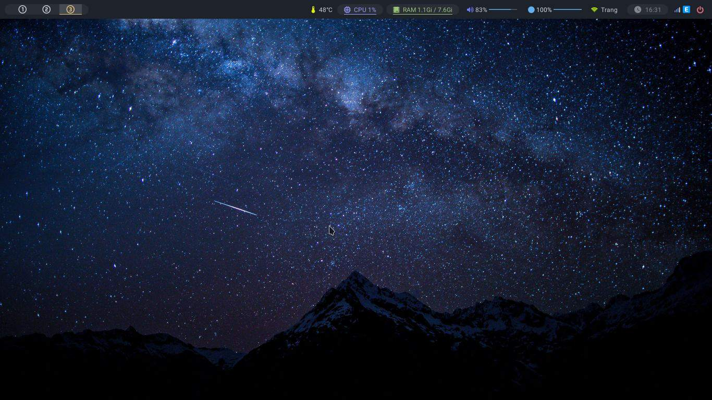

# Polybar



## Install [_polybar_](https://github.com/polybar/polybar) :

```bash
sudo pacman -S polybar
```

## Options config

- [Polybar-github](https://github.com/polybar/polybar/wiki)
- [Polybar-wiki.archlinux](https://wiki.archlinux.org/index.php/polybar)

## Copy my config:

```bash
git clone https://github.com/Frey1a/dotfiles.git
cp -a dotfiles/.config/polybar ~/.config
rm -rf dotfiles
```

## Structure

```
├── config.ini                  config file
│
├── launch.sh                   source file
│
└── module.ini	                modurles

```

## Set up

> make root file

```bash
chmod + x ~/.config/polybar/launch.sh
```

> add `.config/i3/config`:

```bash
#Polybar
exec_always --no-startup-id $HOME/.config/polybar/launch.sh
```
