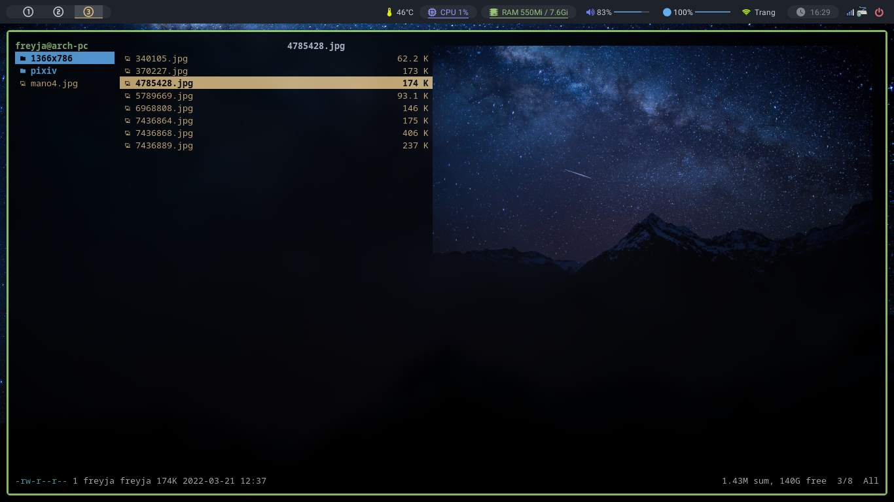

# Ranger



## Install [_ranger_](https://github.com/ranger/ranger)

```bash
sudo pacman -S ranger
```

## Dependence

```bash
# Show image, video
sudo pacman -S feh mpv
```

[Ranger icons](https://github.com/alexanderjeurissen/ranger_devicons)

> Ranger icons is already on my config

## Copy my config:

```bash
git clone https://github.com/Frey1a/dotfiles.git
cp -a dotfiles/.config/ranger ~/.config
rm -rf dotfiles
```

## More detail

Go [here](https://github.com/ranger/ranger)
