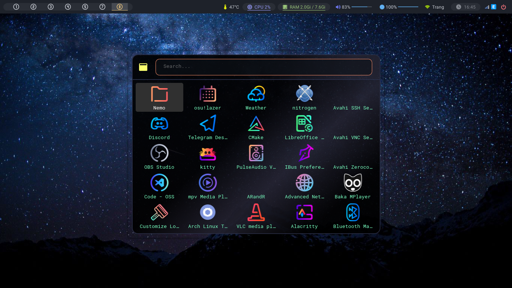
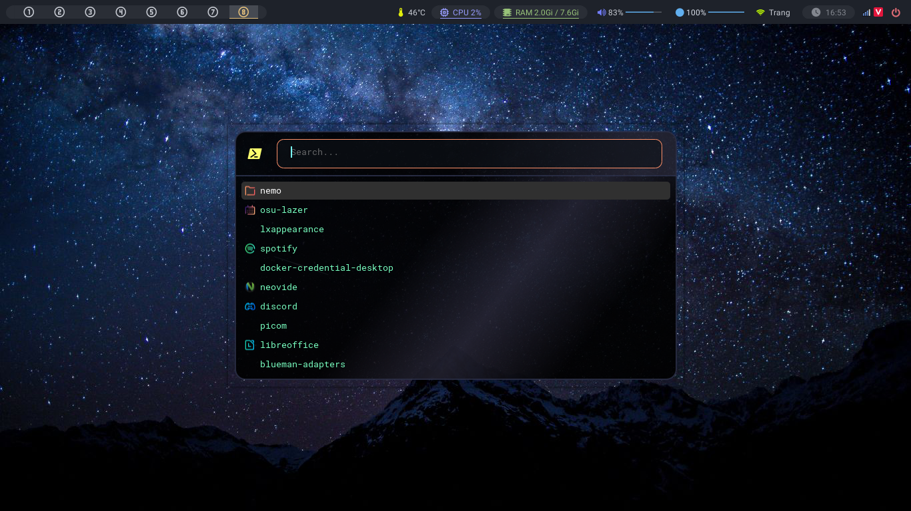
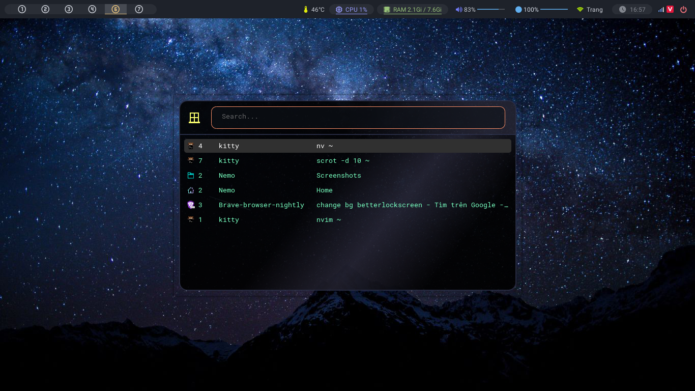
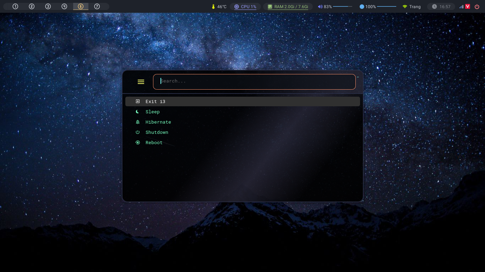

# Rofi


</br>
</br>

<details>
  <summary>More Screenshot</summary>

</br>
</br>

---


</br>
</br>

---


</br>
</br>

---



</br>
</br>
</details>

## Install [_rofi_](https://github.com/davatorium/rofi)

```bash
sudo pacman -S rofi
```

## Copy my config:

```bash
git clone https://github.com/Frey1a/dotfiles.git
cp -a dotfiles/.config/rofi ~/.config
cp -a dotfiles/.config/tools ~/.config
rm -rf dotfiles
```

## Set up

Add on `.config/i3/config`

```bash

# Rofi application
bindsym $mod+d exec rofi -theme "applications.rasi" -show drun

# use rofi as alt+tab
bindsym Mod1+Tab exec bash $HOME/.config/tools/rofi/alt-tab-rofi.sh

# Start rofi run
bindsym $mod+Shift+a exec rofi -show run

# Menu power off
bindsym $mod+Shift+a exec ~/.config/tools/rofi/rofi-close-i3.sh
```

> You can change any key for your config

## More detail [here](https://github.com/davatorium/rofi)
