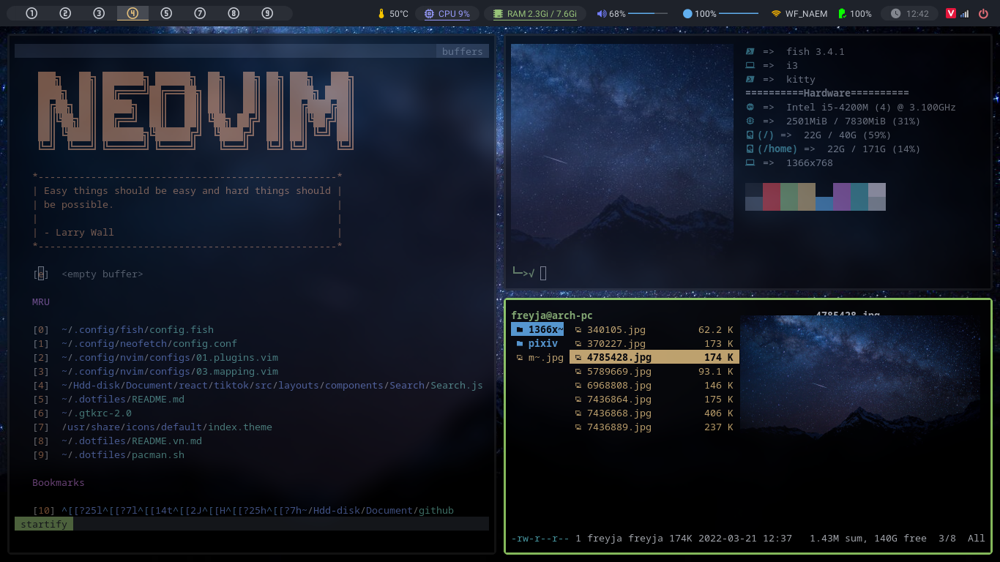

# Hi there! Welcome to my [dotfiles](https://github.com/Dominic-github/dotfiles)



**_Quick Links_**

- [_Install_](#install)
  - [One command](#one-command)
  - [Starting with a fresh Arch based installation](#fresh-arch-based)
- [_Software I use_](#software)

</br>

# Table of Contents

- [Install](#install)
  - [My configuration](#one-command)
    - [Overview](#one-command_over-view)
  - [Starting with a fresh Arch based installation](#fresh-arch-based)
    - [Overview](#over-view-beginer)
    - [Arch installation](#arch-installation)
    - [Login and window manager](#login-and-window-manager)
    - [Basic i3 configuration](#basic-i3-configuration)
    - [Basic system utilities](#basic-system-utilities)
      - [Wallpaper](#wallpaper)
      - [Fonts](#fonts)
      - [Audio](#audio)
      - [Monitors](#monitors)
      - [Network](#network)
      - [Systray](#systray)
      - [Notifications](#notifications)
      - [Xprofile](#xprofile)
    - [Further configuration and tools](#further-configuration-and-tools)
      - [AUR helper](#aur-helper)
      - [Media Transfer Protocol](#media-transfer-protocol)
      - [File Manager](#file-manager)
      - [Trash](#trash)
      - [GTK Theming](#gtk-theming)
      - [Lightdm theming](#lightdm-theming)
      - [Multimedia](#multimedia)
      - [Images](#images)
      - [Video and audio](#video-and-audio)
    - [Start Hacking](#start-hacking)
- [Software](#software)
  - [Basic utilities](#software-basic)
  - [Fonts, theming and GTK](#software-fonts)
  - [Apps](#software-apps)

<div id="install"/>

<br/>

<div id="one-command"/>

## **🚀 My configuration**

<div id="one-command_over-view"/>

### 📖 Overview

- My configurations are heavily documented to make it as clear as possible. While you can clone the whole repository and use it, it is not recommended though. Good configurations are personal. Everyone should have his or her unique config file. You are encouraged to copy from this repo the part you want and add it to your own config.

- I have to guide how to rice [here](#fresh-arch-based)

- This way download is automatic. Only use when you have successfully installed and set up linux distro

<p>⛔ DO NOT RUN WITH ROOT </p>

> #### Copy and paste on terminal

###### with bash, zsh, ...

```bash
bash <(curl -s https://raw.githubusercontent.com/Dominic-github/dotfiles/main/bin/install.sh)
```

###### with fish

```bash
bash (curl -s https://raw.githubusercontent.com/Dominic-github/dotfiles/main/bin/install.sh | psub)
```

</br>

<div id="fresh-arch-based"/>

## **🚀 Starting with a fresh Arch based installation**

<div id="over-view-beginer"/>

### 📖 Overview

This guide will walk you through the process of building a desktop environment
starting with a fresh Arch based installation. I will assume that you are
comfortable with Linux based operating systems and command line interfaces.
Because you are reading this, I will also assume that you've looked through some
"tiling window manager" videos on Youtube, because that's where the rabbit hole
starts. You can pick any window managers you want, but I'm going to use i3
as a first tiling window manager because that's what I started with. This is
basically a description of how I made my desktop environment from scratch.

<div id="arch-installation"/>

### 🖊️ Arch installation

Installation guide and basic configurations for Arch Linux

> #### 📝 Verify the boot mode

Check if the directory exists:

```bash
ls /sys/firmware/efi/efivars
```

> #### 📝 Connect to the internet

Connect to Wi-Fi network:

```bash
wifi-menu
```

Check if internet connectivity is available:

```bash
ping -c 3 archlinux.org
```

> #### 📝 Update the system clock

Ensure the system clock is accurate:

```bash
timedatectl set-ntp true
```

Check the service status:

```bash
timedatectl status
```

> #### 📝 Partition the disks

Identify disks:

```bash
lsblk
```

Disks are assigned to a _block device_ such as `/dev/nvme0n1`.

Clean the entire disk (**do not** do this if you want to keep your data):

- `# gdisk /dev/nvme0n1`
- `x` for extra functionality
- `z` to _zap_ (destroy) GPT data structures and exit
- `y` to proceed
- `y` to blank out MBR

Create boot partition and root partition:

- `# cfdisk /dev/nvme0n1`
- Select `gpt`
- Hit `[ New ]` to create a new patition
- Give the boot partition `1G` and let the rest for the root partition
- Select the boot partition and hit `[ Type ]` to choose `EFI System`
- Hit `[ Write ]` then type `yes` to save, then hit `[ Quit ]`

> #### 📝 Format the partitions

Format the boot partition to FAT32:

```bash
mkfs.fat -F32 /dev/nvme0n1p1
```

Format the root partition to ext4:

```bash
mkfs.ext4 /dev/nvme0n1p2
```

> #### 📝 Mount the file systems

Mount root partition first:

```bash
mount /dev/nvme0n1p2 /mnt
```

Then create mount point for boot partition and mount it accordingly:

```bash
mkdir /mnt/boot
```

```bash
mount /dev/nvme0n1p1 /mnt/boot
```

> #### 📝 Select the mirrors

Make a list of mirrors sorted by their speed then remove those from the list that are out of sync according to their [status](https://www.archlinux.org/mirrors/status/).

Backup the existing mirrorlist:

```bash
cp /etc/pacman.d/mirrorlist /etc/pacman.d/mirrorlist.backup
```

Edit the mirror list, bring the fastest mirrors to the top (you can use `nano` instead of `vim` or `nvim`).
For example this is my top 3 mirrors:

```bash
vim /etc/pacman.d/mirrorlist
```

```
##
## Arch Linux repository mirrorlist
## Filtered by mirror score from mirror status page
## Generated on 2019-03-01
##

## Singapore
Server = http://mirror.0x.sg/archlinux/$repo/os/$arch
## Vietnam
Server = http://f.archlinuxvn.org/archlinux/$repo/os/$arch
## Netherlands
Server = http://archlinux.mirror.pcextreme.nl/$repo/os/$arch
```

> #### 📝 Install the base and base-devel packages

Use the **pacstrap** script:

```bash
pacstrap /mnt base linux linux-firmware base-devel
```

> #### 📝 Generate an fstab file

Use `-U` or `-L` to define by UUID or labels:

```bash
genfstab -U /mnt >> /mnt/etc/fstab
```

> #### 📝 Chroot

Change root to the new system:

```bash
arch-chroot /mnt
```

> #### 📝 Install optional packages

```bash
pacman -S efibootmgr intel-ucode
```

```bash
pacman -S networkmanager
```

```bash
pacman -S git neovim
```

> #### 📝 Create swap file

As an alternative to creating an entire swap partition, a swap file offers the ability to vary its size on-the-fly, and is more easily removed altogether.

- Create a 32 GB (depend on your RAM) swap file:

```bash
fallocate -l 32G /swapfile
```

- Set the right permissions:

```bash
chmod 600 /swapfile
```

- format it to swap:

```bash
mkswap /swapfile
```

- Activate the swap file:

```bash
swapon /swapfile
```

- Edit fstab at `/etc/fstab` to add an entry for the swap file:

- `nvim /etc/fstab`:

```bash
swapfile none swap defaults 0 0
```

> #### 📝 Configure time zone

Set your time zone by region:

```bash
ln -sf /usr/share/zoneinfo/Asia/Ho_Chi_Minh /etc/localtime
```

Generate `/etc/adjtime`:

```bash
hwclock --systohc
```

> #### 📝 Configure locale

Uncomment `en_US.UTF-8 UTF-8` in `/etc/locale.gen`, then generate it:

```bash
sed -i 's/^#en_US.UTF-8 UTF-8/en_US.UTF-8 UTF-8/g' /etc/locale.gen && locale-gen
```

Set LANG variable in `/etc/locale.conf`:

```bash
echo 'LANG=en_US.UTF-8' > /etc/locale.conf
```

> #### 📝 Change host name

Create hostname file at `/etc/hostname` contain the host name, for example:

```bash
echo 'ArchLinux' > /etc/hostname
```

> #### 📝 Set your root password

```bash
passwd
```

Enter your password then confirm it.

> #### 📝 Install boot loader

There are many ways to boot but I prefer these method

#### Boot with EFISTUB:

Kernel can be booted directly by a UEFI motherboard

```bash
efibootmgr -d /dev/nvme0n1 -p 1 -c -L "Arch Linux" -l /vmlinuz-linux -u 'initrd=/intel-ucode.img initrd=/initramfs-linux.img root=/dev/nvme0n1p2 rw quiet' -v
```

#### Boot with systemd-boot

Install `systemd-boot` to the `/boot` partition:

```bash
bootctl --path=/boot install
```

Edit `systemd-boot` options:

```bash
nvim /boot/loader/loader.conf
```

```bash
default arch
timeout 0
editor  0
```

Add Arch boot entry:

```bash
nvim /boot/loader/entries/arch.conf
```

```bash
title   Arch Linux
linux   /vmlinuz-linux
initrd  /intel-ucode.img
initrd  /initramfs-linux.img
options root=/dev/nvme0n1p2 rw quiet
```

> #### 📝 Enable network services

```bash
systemctl enable NetworkManager
```

> #### 📝 Add new user

Add a new user named `your-name`:

```bash
useradd -m your-name
```

Protect the newly created user `your-name` with a password:

```bash
passwd your-name
```

Grant permissions to users

```bash
usermod -aG wheel,audio,video,optical,storage,power your-name
```

Establish `nvim` as the **visudo** editor:

`EDITOR=nvim visudo`

Then uncomment `%wheel ALL=(ALL) ALL` to allow members of group `wheel` sudo access, uncomment `Defaults targetpw` and change it to `Defaults rootpw` to ask for the root password instead of the user password (then change the comment beside it accordingly).

> #### 📝 Reboot

Exit the chroot environment by typing:

`exit`

Optionally manually unmount all the partitions with:

`umount -R /mnt`

Restart the machine:

`reboot`

After logging in, your internet should be working just fine, but that's only if
your computer is plugged in. If you're on a laptop with no Ethernet ports, you
might have used **[iwctl](https://wiki.archlinux.org/index.php/Iwd#iwctl)**
during installation, but that program is not available anymore unless you have
installed it explicitly. However, we've installed
**[NetworkManager](https://wiki.archlinux.org/index.php/NetworkManager)**,
so no problem, this is how you connect to a wireless LAN with this software:

```bash
# List all available networks
nmcli device wifi list
# Connect to your network
nmcli device wifi connect YOUR_SSID password YOUR_PASSWORD
```

Check [this page](https://wiki.archlinux.org/index.php/NetworkManager#nmcli_examples)
for other options provided by _nmcli_. The last thing we need to do before
thinking about desktop environments is installing **[Xorg](https://wiki.archlinux.org/index.php/Xorg)**:

```bash
sudo pacman -S xorg
```

<div id="login-and-window-manager"/>

### 🖊️ Login and Window Manager

- If you want get my config you can come back [here](#one-command).

First, we need to be able to login and open some programs like a browser and a
terminal, so we'll start by installing **[lighdm](https://wiki.archlinux.org/index.php/LightDM)**
and **[i3](https://wiki.archlinux.org/index.php/i3)**. Lightdm will not
work unless we install a **[greeter](https://wiki.archlinux.org/index.php/LightDM#Greeter)**. Then, a text editor is necessary for editing config files, you can use
**[vscode](https://wiki.archlinux.org/index.php/Visual_Studio_Code)** or jump
straight into **[neovim](https://wiki.archlinux.org/index.php/Neovim)** if you
have previous experience, otherwise I wouldn't suggest it. Last but not least,
we need a browser.

```bash
sudo pacman -S lightdm lightdm-gtk-greeter i3 code firefox
```

Enable _lightdm_ service and restart your computer, you should be able to log into
I3 through _lightdm_.

```bash
sudo systemctl enable lightdm
reboot
```

<div id='basic-i3-configuration'/>

### 🖊️ Basic I3 configuration

Now that you're in I3, you should know some of the default keybindings.

| Key                 | Action                    |
| ------------------- | ------------------------- |
| **mod + return**    | launch xterm              |
| **mod + j**         | focus left window         |
| **mod + k**         | focus down window         |
| **mod + l**         | focus up window           |
| **mod + ;**         | focus right window        |
| **mod + d**         | dmenu                     |
| **mod + Shift + q** | kill window               |
| **mod + Shift + r** | reset i3                  |
| **mod + Shift + e** | Exit i3 come back lightdm |

See more on [i3-tutorial](https://i3wm.org/docs/userguide.html#_default_keybindings)

</br>

Before doing anything else, if you don't have a US keyboard, you should
change it using _setxkbmap_. To open xterm use **mod + return**. For example to
change your layout to vietnamese:

```bash
setxkbmap vn
```

Note that this change is not permanent, if you reboot you have to type that
command again. See [this section](#xprofile) for making it permanent, or
follow the natural order of this guide if you have enough time.

There is no menu by default, you have to launch programs through xterm. At this
point, you can pick your terminal emulator of choice and install a program
launcher.

#### **📝 Install a terminal**

```bash
# Install another terminal emulator if you want
sudo pacman -S alacritty
```

Normally i3 will automatically get the terminal. If it doesn't work
Now open the config file:

```bash
code ~/.config/i3/config
```

At the beginning, after imports, you should find an array called keys, and it contains the following line:

```
bindsym $mod+Return exec i3-sensible-terminal
```

Change that line to launch your terminal emulator:

```bash
# Change another terminal emulator if you want
bindsym $mod+Return exec alacritty
```

#### **📝 Install a program launcher lies** **[dmenu](https://wiki.archlinux.org/index.php/Dmenu)** or **[rofi](https://wiki.archlinux.org/index.php/Rofi)**:

```bash
sudo pacman -S rofi
```

Then add keybindings for that program.

find line :

```bash
# start dmenu (a program launcher)
bindsym $mod+d exec dmenu_run
```

Change that line to launch your terminal emulator:

```bash
# start dmenu (a program launcher)
bindsym $mod+d exec [program launcher]
# ex with rofi:
bindsym $mod+d exec rofi -run --show-icons
## Can change run = drun or something
```

Now restart i3 with **mod + Shift+ r**. You should be able to open your
menu and terminal emulator with keybindings. If you picked rofi, you can
change its theme like so:

```bash
rofi-theme-selector
```

> _Go [here](https://github.com/Dominic-github/dotfiles/tree/main/.config/rofi) for my config_

<div id="full-path-of-commands"/>

#### **📝 A utility to show the full path of commands**

```bash
sudo pacman -S which
```

That's it for i3 , now you can start hacking on it and make it your own.
Checkout my custom i3 config
[here](https://github.com/Dominic-github/dotfiles/tree/main/.config/i3).
But before that I would recommend configuring basic utilities like audio,
battery, mounting drives, etc.

<div id='basic-utilities'/>

### 🖊️ Basic system utilities

In this section we will cover some software that almost everybody needs on their
system. Keep in mind though that the changes we are going to make
will not be permanent. [This subsection](#xprofile) describes how to accomplish
that.

<div id="wallpaper"/>

#### 📝 Wallpaper

First things first, your screen looks empty and black, so you might want to have
a wallpaper not to feel so depressed. You can open _firefox_ through _rofi_
using **mod + d** and download one. Then install
**[feh](https://wiki.archlinux.org/index.php/Feh)** or
**[nitrogen](https://wiki.archlinux.org/index.php/Nitrogen)**
and and set your wallpaper:

```bash
sudo pacman -S feh
feh --bg-scale path/to/wallpaper
```

<div id='fonts' />

##### 📝 Fonts

Fonts in Arch Linux are basically a meme, before you run into any problems
you can just use the simple approach of installing these packages:

```bash
sudo pacman -S ttf-dejavu ttf-liberation noto-fonts
```

To list all available fonts:

```bash
fc-list
```

<div id='audio'/>

##### 📝 Audio

There is no audio at this point, we need
**[pulseaudio](https://wiki.archlinux.org/index.php/PulseAudio)**.
I suggest also installing a graphical program to control audio like
**[pavucontrol](https://www.archlinux.org/packages/extra/x86_64/pavucontrol/)**,
because we don't have keybindings for that yet:

```bash
sudo pacman -S pulseaudio pavucontrol
```

On Arch,
[pulseaudio is enabled by default](https://wiki.archlinux.org/index.php/PulseAudio#Running),
but you might need to reboot in order for it to actually start. After rebooting,
you can open _pavucontrol_ through _rofi_, unmute the audio, and you should be
just fine.

Now you can set up keybindings for _pulseaudio_, open file `~/.config/i3/config` and add
these keys:

```bash
# volume
bindsym XF86AudioRaiseVolume exec --no-startup-id pactl set-sink-volume @DEFAULT_SINK@ +10%
bindsym XF86AudioLowerVolume exec --no-startup-id pactl set-sink-volume @DEFAULT_SINK@ -10%
bindsym XF86AudioMute exec --no-startup-id pactl set-sink-volume @DEFAULT_SINK@ toggle

```

For a better CLI experience though, I recommend using
**[pamixer](https://www.archlinux.org/packages/community/x86_64/pamixer/)**:

```bash
sudo pacman -S pamixer
```

Now you can turn your keybindings into:

```bash
# volume
bindsym XF86AudioMute        exec pamixer -t
bindsym XF86AudioRaiseVolume exec pamixer -i 5
bindsym XF86AudioLowerVolume exec pamixer -d 5
```

Now you can turn your keybindings into:

Restart i3 with **mod + Shift+ r** and your keybindings should work. If
you're on a laptop, you might also want to control the brightness of your screen,
and for that I recommend
**[brightnessctl](https://www.archlinux.org/packages/community/x86_64/brightnessctl/)**:

```bash
sudo pacman -S brightnessctl
```

You can add these keybindings and restart i3 after:

```bash
# Brightness
bindsym XF86MonBrightnessUp exec --no-startup-id brightnessctl set +5%
bindsym XF86MonBrightnessDown exec --no-startup-id brightnessctl set 5%-
```

<div id='monitors' />

##### 📝 Monitors

If you have a multi-monitor system, you surely want to use all your screens.
Here's how **[xrandr](https://wiki.archlinux.org/index.php/Xrandr)** CLI works:

```bash
# List all available outputs and resolutions
xrandr
# Common setup for a laptop and a monitor
xrandr --output eDP-1 --primary --mode 1920x1080 --pos 0x1080 --output HDMI-1 --mode 1920x1080 --pos 0x0
```

We need to specify the position for each output, otherwise it will default to
0x0, and all your outputs will be overlapped. Now if you don't want to calculate pixels
and stuff you need a GUI like
**[arandr](https://www.archlinux.org/packages/community/any/arandr/)**:

```bash
sudo pacman -S arandr
```

Open it with _rofi_, arrange your screens however you want, and then you can
save that layout, which will basically give you a shell script with the exact
_xrandr_ command that you need. Save that script, but don't click "apply" just
yet.

For a multi-monitor system, it's recommended to create an instance of a
_Screen_ object for each monitor in your i3 config.

You'll find an array called _screens_ which contains only one object
initialized with a bar at the bottom. Inside that bar you can see the default
widgets that come with it.

Add as many screens as you have and copy-paste all widgets, later you can
customize them. Now you can go back to arandr, click _apply_, and then restart
i3.

Now your multi-monitor system should work.

<div id='network' />

#### 📝 Network

We have configured the network through _nmcli_, but a graphical frontend is
more friendly. I use
**[nm-applet](https://wiki.archlinux.org/index.php/NetworkManager#nm-applet)**:

```bash
sudo pacman -S network-manager-applet
```

<div id='systray' />

#### 📝 Systray

By default, you have a system tray in i3
You can add them on `.config/i3/config` with

```bash
#===========================EXECUTABLES===================================

# Syntax:  exec + conmand
# --no-startup-id is flag

#feh
exec_always --no-startup-id feh --bg-fill path/to/image

#picom
exec_always --no-startup-id picom

# network manage applet
exec_always --no-startup-id nm-applet

#==========================================================================
```

Now you should see icons that you can click to configure drives and networking.
Optionally, you can install tray icons for volume and battery.
If you want using polybar you can go to [_Polybar_](#status-bar)

```bash
sudo pacman -S volumeicon cbatticon
volumeicon &
cbatticon &
```

<div id='notifications' />

#### 📝 Notifications

I like having desktop notifications as well, for that you need to install
[dunst](https://wiki.archlinux.org/index.php/dunst)

```bash
sudo pacman -S dunst
```

Test it like so:

```bash
notify-send "Hello World"
```

<div id='status-bar' />

#### 📝 Status bar

It will be difficult for a novice to configure the polybar. But think it's simple when you just put the module together.
Go [Here](https://github.com/Dominic-github/dotfiles/tree/main/.config/polybar) for more details

```bash
sudo pacman -S polybar
```

Add on `i3/config`

```bash
exec_always --no-startup-id polybar
```

> Don't exec on xrofile because polybar need reading module after started

<div id='xprofile' />

#### 📝 Xprofile

As I have mentioned before, all these changes are not permanent. In order to
make them permanent, we need a couple things. First, install
**[xinit](https://wiki.archlinux.org/index.php/Xinit)**:

```bash
sudo pacman -S xorg-xinit
```

Now you can use _~/.xprofile_ to run programs before your window manager starts:

```bash
touch ~/.xprofile
```

For example, if you place this in _~.xprofile_:

```bash
nm-applet &
udiskie -t &
volumeicon &
cbatticon &
feh --bg-fill path/to/image &
```

Every time you login you will have all systray utilities, your keyboard layout
and monitors set.

<div id='further-configuration-and-tools' />

### 🖊️ Further configuration and tools

<div id='aur-helper' />

#### 📝 AUR helper

Now that you have some software that allows you tu use your computer without
losing your patience, it's time to do more interesting stuff. First, install an
**[AUR helper](https://wiki.archlinux.org/index.php/AUR_helpers)**, I use
**[yay](https://github.com/Jguer/yay)**:

```bash
sudo pacman -S base-devel git
cd /opt/
sudo git clone https://aur.archlinux.org/yay-git.git
sudo chown -R username:username yay-git/
cd yay-git
makepkg -si
cd $HOME
```

With an _Arch User Repository helper_, you can basically install
any piece of software on this planet that was meant to run on Linux.

<div id='media-transfer-protocol' />

#### 📝 Media Transfer Protocol

If you want to connect your phone to your computer using a USB port, you'll
need MTP implementation and some CLI to use it, like
[this one](https://aur.archlinux.org/packages/simple-mtpfs/):

```bash
sudo pacman -S libmtp
yay -S simple-mtpfs

# List connected devices
simple-mtpfs -l
# Mount first device in the previous list
simple-mtpfs --device 1 /mount/point
```

<div id='file-manager' />

#### 📝 File Manager

We've done all files stuff through a terminal up to this point, but you can
install graphical or terminal based file managers.
For a graphical one, I suggest
**[nemo](https://wiki.archlinux.org/index.php/nemo)**
and for a terminal based one,
**[ranger](https://wiki.archlinux.org/index.php/Ranger)**, although this one
is very vim-like, only use it if you know how to move in vim.

```bash
sudo pacman -S nemo ranger
```

<div id='trash' />

#### 📝 Trash

If you don't want to _rm_ all the time and potentially lose files, you need a
trashing system. Luckily, that's pretty easy to do, using
[some of these tools](https://wiki.archlinux.org/index.php/Trash_management#Trash_creation)
such as **[glib2](https://www.archlinux.org/packages/core/x86_64/glib2/)**,
and for GUIs like _thunar_ you need **[gvfs](https://www.archlinux.org/packages/extra/x86_64/gvfs/)**:

```bash
sudo pacman -S glib2 gvfs
# CLI usage
gio trash path/to/file
# Empty trash
gio trash --empty
```

With _nemo_ you can open the trash clicking on the left panel, but on the command
line you can use:

```bash
ls ~/.local/share/Trash/files
```

<div id='gtk-theming' />

#### 📝 GTK Theming

The moment you have been wating for has arrived, you are finally going to
install a dark theme. I use _Material Black Colors_, so go grab a flavor
[here](https://www.gnome-look.org/p/1316887/) and the matching icons
[here](https://www.pling.com/p/1333360/).

I suggest starting with
_Material-Black-Blueberry_ and _Material-Black-Blueberry-Suru_. You can find
other GTK themes [on this page](https://www.gnome-look.org/browse/cat/135/).
Once you have your theme folders downloaded, this is what you do:

- ##### Automatic

```bash
yay -S material-black-colors-theme
```

- ##### Manual install

```bash
## Assuming you have downloaded Material-Black-Blueberry
cd Downloads/
sudo pacman -S unzip
unzip Material-Black-Blueberry.zip
unzip Material-Black-Blueberry-Suru.zip
rm Material-Black*.zip

## Make your themes available
sudo mv Material-Black-Blueberry /usr/share/themes
sudo mv Material-Black-Blueberry-Suru /usr/share/icons
```

Now edit **~/.gtkrc-2.0** and **~/.config/gtk-3.0/settings.ini** by adding
these lines:

```ini
# ~/.gtkrc-2.0
gtk-theme-name = "Material-Black-Blueberry"
gtk-icon-theme-name = "Material-Black-Blueberry-Suru"

# ~/.config/gtk-3.0/settings.ini
gtk-theme-name = Material-Black-Blueberry
gtk-icon-theme-name = Material-Black-Blueberry-Suru
```

Next time you log in, these changes will be visible. You can also install a
different cursor theme, for that you need
**[xcb-util-cursor](https://www.archlinux.org/packages/extra/x86_64/xcb-util-cursor/)**.
The theme I use is
[Sweet Cursor](https://www.gnome-look.org/p/1393084/),:

- ##### Automatic

```bash
yay -S xcb-util-cursor sweet-cursors-theme-git
```

- ##### Manual install

```bash
sudo pacman -S xcb-util-cursor
cd Downloads/
tar -xf Sweet-cursors.tar.gz
sudo mv Sweet-cursors /usr/share/icons
```

Edit **/usr/share/icons/default/index.theme** by adding this:

```ini
[Icon Theme]
Inherits = Sweet-cursors
```

Now, again, edit **~/.gtkrc-2.0** and **~/.config/gtk-3.0/settings.ini**:

```ini
# ~/.gtkrc-2.0
gtk-cursor-theme-name = "Sweet-cursors"

# ~/.config/gtk-3.0/settings.ini
gtk-cursor-theme-name = Sweet-cursors
```

Make sure not to mistype the names of your themes and icons, they should
match the names of the directories where they are located, the ones you can
see in this output:

```bash
ls /usr/share/themes
ls /usr/share/icons
```

Remember that you will only see the new theme if you log in again.
There are also graphical frontends for changing themes, I just prefer the
traditional way of editing files though, but you can use
**[lxappearance](https://www.archlinux.org/packages/community/x86_64/lxappearance/)** and [qt5ct](https://archlinux.org/packages/community/x86_64/qt5ct/),
which is a desktop environment independent GUI for this task, and it lets you
preview themes.

```bash
sudo pacman -S lxappearance qt5ct
```

Finally, if you want tranparency and fancy looking things, install a compositor:

```bash
sudo pacman -S picom

# Recomen run in i3 configs
exec_always --no-startup-id picom

# or in ~/.xrofile (Have some bugs)
picom &
```

<div id='lightdm-theming' />

#### 📝 Lightdm theming

We can also change the theme of _lightdm_ and make it look cooler, because why
not? We need another greeter, and some theme, namely
**[lightdm-webkit2-greeter](https://www.archlinux.org/packages/community/x86_64/lightdm-webkit2-greeter/)**
and **[lightdm-webkit-theme-aether](https://aur.archlinux.org/packages/lightdm-webkit-theme-aether/)**:

```bash
sudo pacman -S lightdm-webkit2-greeter
yay -S lightdm-webkit-theme-aether
```

These are the configs you need to make:

```ini
# /etc/lightdm/lightdm.conf
[Seat:*]
# ...
# Uncomment this line and set this value
greeter-session = lightdm-webkit2-greeter
# ...

# /etc/lightdm/lightdm-webkit2-greeter.conf
[greeter]
# ...
webkit_theme = lightdm-webkit-theme-aether
```

Ready to go.

<div id='multimedia' />

#### 📝 Multimedia

There are dozens of programs for multimedia stuff, check
[this page](https://wiki.archlinux.org/index.php/List_of_applications/Multimedia).

<div id='image' />

##### ✒️ Images

For image previews, one of the best that I could find is [sxiv](https://wiki.archlinux.org/index.php/sxiv) and [feh](https://wiki.archlinux.org/index.php/feh).

```bash
sudo pacman -S sxiv feh
```

<div id='video-and-audio' />

##### ✒️ Video and audio

No doubt
[vlc](https://wiki.archlinux.org/index.php/VLC_media_player)
is exactly what you need:

```bash
sudo pacman -S vlc
```

<div id='start-hacking' />

### 🖊️ Start Hacking

With all you've done so far, you got all the tools to start playing with configs
and make your desktop environment, well, yours. What I recommend is hacking
on i3 to adding keybindings for common programs like _firefox_,
a text editor, file manager, etc.

Once you feel comfortable with i3, you can install other
tiling window managers, and you will have more sessions available when logging
in through _lightdm_.

<div id='software'/>

## 🛠️ Software

<div id='software-basic'/>

### 📝 Basic utilities

| Software                                                                                    | Utility                  |
| ------------------------------------------------------------------------------------------- | ------------------------ |
| **[Networkmanager](https://wiki.archlinux.org/index.php/NetworkManager)**                   | Self explanatory         |
| **[Network-manager-applet](https://wiki.archlinux.org/index.php/NetworkManager#nm-applet)** | _NetworkManager_ systray |
| **[Pulseaudio](https://wiki.archlinux.org/index.php/PulseAudio)**                           | Self explanatory         |
| **[Pavucontrol](https://www.archlinux.org/packages/extra/x86_64/pavucontrol/)**             | _pulseaudio_ GUI         |
| **[Pamixer](https://www.archlinux.org/packages/community/x86_64/pamixer/)**                 | _pulseaudio_ CLI         |
| **[Arandr](https://www.archlinux.org/packages/community/any/arandr/)**                      | GUI for _xrandr_         |
| **[Brightnessctl](https://www.archlinux.org/packages/community/x86_64/brightnessctl/)**     | Laptop screen brightness |
| **[StarShip](https://github.com/starship/starship)**                                        | The cross-shell prompt   |
| **[Dunst](https://wiki.archlinux.org/index.php/Dunst)**                                     | Desktop notifications    |
| **[Xidlehook](https://github.com/jD91mZM2/xidlehook)**                                      | System suspend           |

<div id='software-fonts'/>

### 📝 Fonts, theming and GTK

| Software                                                                                  | Utility                    |
| ----------------------------------------------------------------------------------------- | -------------------------- |
| **[Picom](https://wiki.archlinux.org/index.php/Picom)**                                   | Compositor for Xorg        |
| **[Roboto Mono Nerd Font ](https://aur.archlinux.org/packages/nerd-fonts-roboto-mono/)**  | Nerd Font for icons        |
| **[Fira Code Nerd Font ](https://aur.archlinux.org/packages/nerd-fonts-roboto-mono/)**    | Nerd Font for icons        |
| **[Material Desgin Icons](https://aur.archlinux.org/packages/ttf-material-design-icons)** | Font, Theme and icons      |
| **[Material Black Theme](https://www.gnome-look.org/p/1316887)**                          | Theme                      |
| **[Candy Icons](https://www.gnome-look.org/p/1305251)**                                   | Icons                      |
| **[Unifont](https://aur.archlinux.org/packages/nerd-fonts-roboto-mono/)**                 | Icons                      |
| **[Sweet Cursor Theme](https://aur.archlinux.org/packages/ttf-material-design-icons)**    | Cursor Theme               |
| **[Lxappearance](https://www.archlinux.org/packages/community/x86_64/lxappearance/)**     | GUI for changing themes    |
| **[Nitrogen](https://wiki.archlinux.org/index.php/Nitrogen)**                             | GUI for setting wallpapers |
| **[Feh](https://wiki.archlinux.org/index.php/Feh)**                                       | CLI for setting wallpapers |
| **[Sxiv](https://wiki.archlinux.org/index.php/Sxiv)**                                     | CLI for setting wallpapers |

<div id='software-apps'/>

### 📝 Apps

| Software                                                                  | Utility                  |
| ------------------------------------------------------------------------- | ------------------------ |
| **[Fish](https://wiki.archlinux.org/index.php/Fish)**                     | Commandline Shell        |
| **[Kitty](https://wiki.archlinux.org/index.php/Kitty)**                   | Terminal emulator        |
| **[Polybar](https://wiki.archlinux.org/index.php/Polybar)**               | Status Bar               |
| **[Nemo](https://wiki.archlinux.org/index.php/Nemo)**                     | Graphical file explorer  |
| **[Ranger](https://wiki.archlinux.org/index.php/Ranger)**                 | Terminal based explorer  |
| **[Neovim](https://wiki.archlinux.org/index.php/Neovim)**                 | Terminal based editor    |
| **[Rofi](https://wiki.archlinux.org/index.php/Rofi)**                     | Menu and window switcher |
| **[Vlc](https://aur.archlinux.org/index.php/Vlc)**                        | Video player             |
| **[Rhythmbox](https://wiki.archlinux.org/index.php/Rhythmbox)**           | Audio player             |
| **[Brave-nightly](https://aur.archlinux.org/packages/brave-nightly-bin)** | Web browse               |
